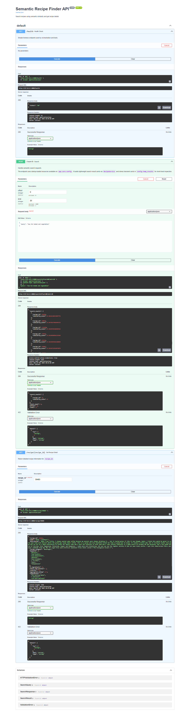

# Semantic Recipe Finder — Backend

The backend provides a small API that performs text-based semantic search and serves lightweight recipe cards and detailed recipe data. At startup the application loads heavy resources (embedding matrix, id list, model, and a master dataframe) and keeps them on the process-global `app.core.config` for fast access.

Features
--------
- Semantic search (`/search`) — POST with JSON body `{ "query": "..." }`. Supports `offset`/`limit` for batched responses.
- Recipe details (`/recipe/{id}`) — GET returns detailed recipe information for a given id.
- Health check endpoint (`/health`) — GET, used for liveness/readiness probes.
- Optional Streamlit-based monitor (`backend/app/app.py`) for local development and quick manual checks.

Swagger Document
-----------------



Screenshot: the automatically generated Swagger UI (OpenAPI) for the backend API.


Tech stack
----------
- Python 3.11+
- FastAPI
- Uvicorn (ASGI server)
- Poetry (dependency management)
- numpy, pandas, sentence-transformers

Quick start (development)
-------------------------
1. Change to the `backend` directory:

```bash
cd backend
```

2. Install dependencies:

```bash
poetry install
```

3. Run the development server (use `--reload` for code reloading):

```bash
poetry run uvicorn app.main:app --reload --host 127.0.0.1 --port 8000
```

Note: from the repository root you can run with `--app-dir backend`.

Configuration
-------------
- Default file paths and model name live in `backend/app/core/config.py`. By default small sample test assets (`test_data/sample_*.npy` and `test_data/sample_master.parquet`) are referenced for local testing.
- To run with production data, update `recipes_details_path`, `metadata_embeddings_path`, `recipe_ids_path`, and `model_name` accordingly (or make them configurable via environment variables).
 - Default file paths and model name live in `backend/app/core/config.py`.
 - To run with other production data, update `recipes_details_path`, `metadata_embeddings_path`, `recipe_ids_path`, and `model_name` accordingly (or make them configurable via environment variables).
- For CORS configuration, set the `CORS_ALLOWED_ORIGINS` environment variable; `backend/app/core/middleware.py` reads this variable and applies CORS middleware.

API Endpoints
-------------
- `GET /health` — liveness check, returns `{ "status": "ok" }`.
- `POST /search?offset={offset}&limit={limit}` — body: `{ "query": "..." }`.
  - Example response (summary):
    ```json
    {
      "search_results": [{ "recipe_id": 123, "similarity_score": 0.9 }, ...],
      "total_count": 300,
      "offset": 0,
      "limit": 20
    }
    ```
  - The `offset`/`limit` parameters are intended for client-side batching (infinite-scroll).
- `GET /recipe/{recipe_id}` — returns detailed recipe JSON.
- API docs: `GET /docs` (Swagger UI) and `GET /redoc` (ReDoc).

Startup resource loading
------------------------
At startup the app loads the embedding matrix, ids array, the sentence-transformers model and the recipes dataframe. This can take time depending on the dataset and model size. The ASGI lifespan handler defined in `app.main` performs these initializations; startup warnings or errors are printed to the console and the app may continue in a degraded mode for testing.

Tests
-----
Unit and integration tests are available under `backend/tests`. Run the test suite with:

```bash
cd backend
poetry run pytest -q
```

Deploy / Render notes
---------------------
- When deploying to Render, add the `CORS_ALLOWED_ORIGINS` environment variable to the service configuration (for example `https://your-frontend.onrender.com`).
- Use `uvicorn` as the web process; do not use `--reload` in production.

Contact
-------
If you have questions or need help, contact the repository owner: `hanifekaptan.dev@gmail.com`.
