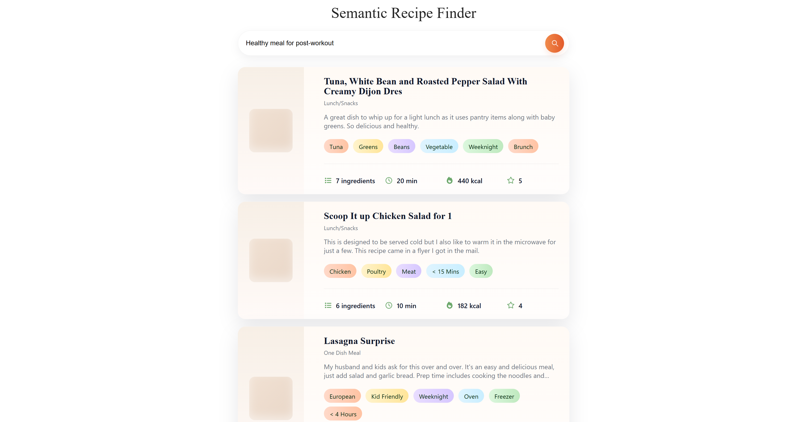
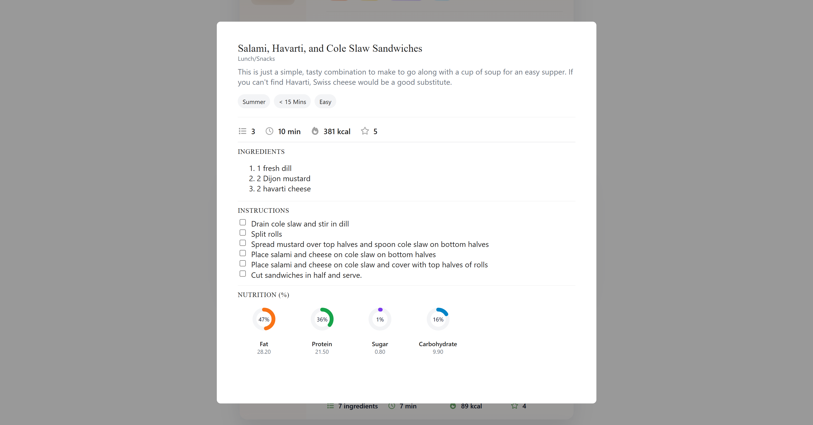

# Semantic Recipe Finder — Project Overview

This repository contains a small full-stack project for searching and browsing recipes using semantic text queries. The project is split into two main parts:

- `backend` — a FastAPI service that hosts the semantic search and recipe detail endpoints.
- `frontend` — a React + Vite single-page application that provides a search UI, result listing and detail modal.

Purpose
-------
The goal of the project is to demonstrate a simple, maintainable architecture for semantic search over recipe metadata with a lightweight frontend that supports infinite-scroll batch loading of results.


UI Preview
----------
A couple of screenshots from the app (place images in `docs/assets/`):





Backend API reference (Swagger) screenshot:


What you'll find in this repo
-----------------------------
- `backend/` — FastAPI app, services, models, utilities for loading embeddings and performing nearest-neighbor search.
- `frontend/` — Vite + React app, components, hooks, and a small API client in `src/api`.
- `docs/` — project documentation (this folder). The docs include API usage, architecture notes, quickstart, testing, and examples.


Quick links
-----------
- Backend README: [backend/README.md](../backend/README.md)
- Frontend README: [frontend/README.md](../frontend/README.md)
- API docs: [docs/api.md](api.md) and live OpenAPI at `http://localhost:8000/openapi.json`
- Quickstart: [docs/quickstart.md](quickstart.md)
- Architecture notes: [docs/architecture.md](architecture.md)
- Tests: [docs/testing.md](testing.md)
- CURL examples: [docs/examples/curl-examples.md](examples/curl-examples.md)


Quick local commands
--------------------
From repository root you can run both services locally for development. Typical commands:

Backend (development):
```bash
cd backend
poetry install
poetry run uvicorn app.main:app --reload --host 127.0.0.1 --port 8000
```

Frontend (development):
```bash
cd frontend
npm install
npm run dev
```

After both services are running:
- API health: `http://localhost:8000/health`
- Frontend UI (Vite): typically at `http://localhost:5173` (check terminal output)

How to use this documentation
----------------------------
- Start with the Quickstart for local setup and then consult the API docs for endpoint details.
- Architecture and implementation notes explain data flow, where embeddings and IDs are stored, and suggestions for scaling.

Contact
-------
If you need help, contact the project owner: hanifekaptan.dev@gmail.com

---

Next step: see `docs/quickstart.md` for a more detailed step-by-step local setup and run instructions.
